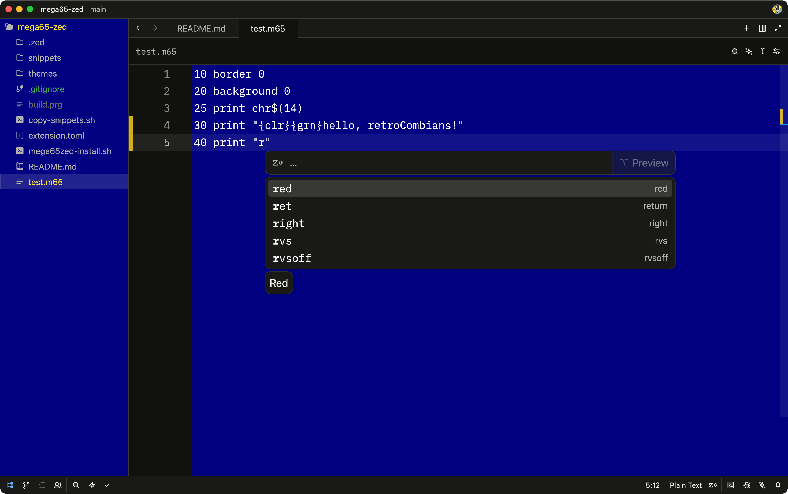

# retroCombs MEGA65-ZED Environment for Mac Version 0.5.0

<p align="center">
  
  <br>
  <em>MEGA65 Zed IDE – theme, snippets and tasks ready to go</em>
</p>

Welcome, retroCombians! 🇺🇲🐰  
This repository turns the lightning-fast [Zed](https://zed.dev) editor into a practical, beautiful development environment for **MEGA65 BASIC65** programming.

You get:
- The iconic MEGA65 rainbow boot-screen theme (deep blue + colorful accents)
- A full set of PETSCII mnemonic snippets (type `clr` → `{clr}`, `10print` → classic hello loop, etc.)
- One-click tasks to compile & send code to real MEGA65 hardware (via Ethernet) or XEMU (`xmega65`)

🚧 **Current status (March 2025):** This is a working personal setup. Snippets and theme are reliable; custom language auto-detection is still experimental.

## 🌟 Features (what actually works today)

- **Beautiful MEGA65 boot-screen theme** — deep blue background, rainbow keyword accents
- **PETSCII & BASIC65 snippets** — 30+ ready-to-use mnemonics and starters
- **One-click build & run tasks** — compile to PRG and send to hardware (`etherload`) or emulator (`xmega65`)
- **.m65 file extension** — auto-opens as Plain Text (snippets work instantly)

## 🛠️ Prerequisites

- macOS (Intel or Apple Silicon)
- [Zed editor](https://zed.dev) installed
- (Optional) XEMU emulator with `xmega65` app in `/Applications` for emulator task
- Internet access for first-time setup (downloads petcat & etherload)

## 🚀 Installation

1. Clone or download this repo to a permanent location (e.g. `~/Projects/mega65-zed`)
2. Open Terminal and `cd` into that folder
3. Make the installer executable:

```bash
chmod +x mega65zed-install.sh
```

4. Run the setup script:

```bash
./mega65zed-install.sh
```

5. Restart Terminal (or `source ~/.zshrc`) so the new tools are in your PATH

## 💻 How to Use

1. **Open the project folder in Zed**  
   File → Open Folder → select `mega65-zed`

2. **Install the dev extension**  
   Zed will prompt you → click **Install Dev Extension**

3. **Copy the snippets once** (run this in the project folder):

```bash
./copy-snippets.sh
```

This copies the PETSCII snippets into Zed's global snippet file so they work everywhere.

4. **Select the theme**  
   Zed → Themes → choose **MEGA65 Dark**

5. **Start coding**  
   - Create files with `.m65` extension (e.g. `hello.m65`)  
   - Type `clr` → Tab → `{clr}`  
   - Type `10print` → Tab → classic rainbow loop  
   - Type `graphic` → Tab → `GRAPHIC 1,1 : REM 320x200 bitmap`

6. **Compile & run**  
   Cmd + Shift + P → type "task: spawn" → choose  
   - **MEGA65: Send to Hardware** (real machine over Ethernet)  
   - **MEGA65: Run in XEMU** (emulator)

## 🔧 Current limitations & roadmap

- `.m65` files open as **Plain Text** (snippets work, but no custom "BASIC65" language name yet)
- Syntax highlighting is basic (more MEGA65-specific keywords coming soon)
- Linux port of install script planned next

## 🔗 Connect & follow along

- [retroCombs on YouTube](https://www.youtube.com/@retrocombs)
- [retroCombs Tech on YouTube](https://www.youtube.com/@retrocombs-tech)
- [The retroCombs Blog](https://www.retrocombs.com)
- MEGA65 community: [mega65.org](https://www.mega65.org) • Discord • Forum

Happy coding, retroCombians!  
`10 PRINT "HELLO, MEGA65!": GOTO 10`

Made with ❤️ by retroCombs, Grok, and Gemini