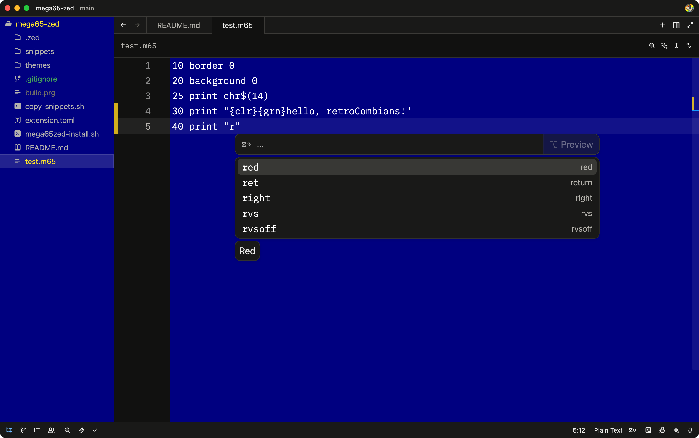

# retroCombs MEGA65-ZED Environment for Mac Version 0.6.0

<p align="center">
  
  <br>
  <em>MEGA65 Zed IDE — navy listing, phosphor Grok, PETSCII tokens</em>
</p>

Turns [Zed](https://zed.dev) into a MEGA65 BASIC65 desk that matches the VIC-20 and C64 workflows in [CBM](https://github.com/stevencombs/CBM): listing on the left, Grok in the **bottom** terminal, Check / Run / Push / Push+run as **your** tasks.

MEGA65-only pieces stay: BASIC65 (`petcat -w65`, load `$2001`), `GRAPHIC`, Ethernet `etherload`, XEMU `xmega65`, and `keymap.cfg` for the emulator.

## Desk

| | MEGA65 |
|--|--|
| Listing | **MEGA65 Dark** — navy paper (`#000080`), gold keywords, green cursor |
| Chrome / Grok | Black glass, phosphor green (same as VIC-20 / C64) |
| Font | Source Code Pro, autosave 1s |
| Files | `.m65` → **CBM BASIC** |
| Check | `petcat -w65` → `export/<name>.prg` |
| Run / Push to XEMU | `/Applications/xmega65.app` `-prg` |
| Push | `~/m65tools/etherload` over Ethernet (load; you type `RUN`) |
| Push+run | `etherload -r` (same as **Send to Hardware**) |

Zed 1.20 Agent chat uses the listing paper. Leave it closed. **⌘⇧G** / **⌘J** toggles the bottom terminal. **task: spawn → Grok Build**.

Open a `.m65` buffer to see the navy paper (an empty pane stays black).

## Install

```bash
chmod +x mega65zed-install.sh scripts/mega65.sh copy-snippets.sh
./mega65zed-install.sh
./copy-snippets.sh
```

In Zed: **zed: extensions → Install Dev Extension** → this folder. Theme **MEGA65 Dark**.

From the CBM repo: `~/CBM/scripts/retro mega65` (or set `MEGA65_ZED` if the clone is not under Google Drive).

## Tasks (command palette → `task: spawn`)

Same verbs as VIC-20 / C64:

| Task | What |
|------|------|
| **MEGA65: Check listing** | Tokenize BASIC65. No emulator, no Ethernet. |
| **MEGA65: Run in XEMU** | Check, then inject PRG into `xmega65`. |
| **MEGA65: Push to XEMU** | Same as Run in XEMU. |
| **MEGA65: Push** | `~/m65tools/etherload` — in memory; you `RUN`. |
| **MEGA65: Push+run** | `etherload -r`. |
| **MEGA65: Send to Hardware** | Alias of Push+run (old name). |
| **Grok Build** | Bottom TUI. |

Grok does not Push. You press those tasks.

## Tokens

Type `red`, `clr`, `orng`, `lred`, `graphic`, `10print` then Tab. Sixteen C64 colours plus F1–F8, using VICE `petcat` spellings (`{rght}`, `{lred}`, `{swlc}`).

MEGA65-only starters: `graphic` → `GRAPHIC 1,1`, `10print` → hello loop.

## Tools

- **petcat -w65** — Homebrew VICE 3.10 on Apple Silicon.
- **~/m65tools** — `etherload`, `m65`, `mega65_ftp` (unprefixed names; `.osx` binaries). On `PATH` for every Terminal via `~/.zshrc`. Extra flags (`--ntsc`, `--mount`, `-j`) stay on the CLI.
- **xmega65** — `/Applications/xmega65.app`, also `~/.local/bin/xmega65`. Optional `keymap.cfg` in this repo goes in the XEMU system folder.

`scripts/mega65.sh` is the same shape as CBM `vic20.sh` / `c64.sh`.

## Prerequisites

- macOS, [Zed](https://zed.dev), Source Code Pro (`brew install --cask font-source-code-pro`)
- Homebrew VICE (`petcat`)
- Optional: XEMU `xmega65` in `/Applications`, MEGA65 on Ethernet for Push

## Connect

- [retroCombs](https://www.retrocombs.com) · [YouTube](https://www.youtube.com/@retrocombs)
- [mega65.org](https://www.mega65.org)

Made with care by retroCombs, Grok, and Gemini.
